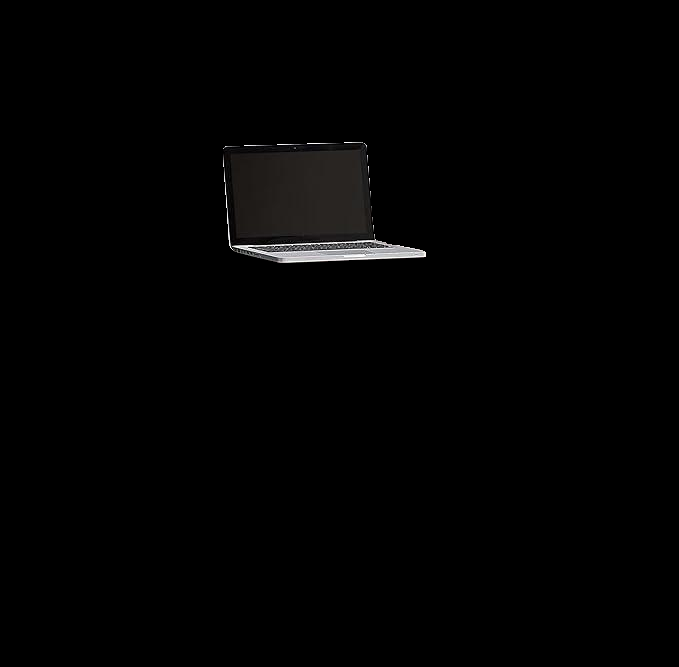
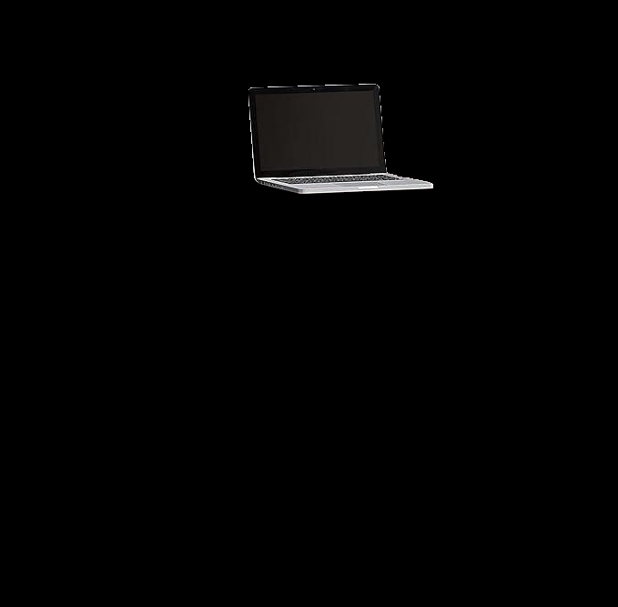
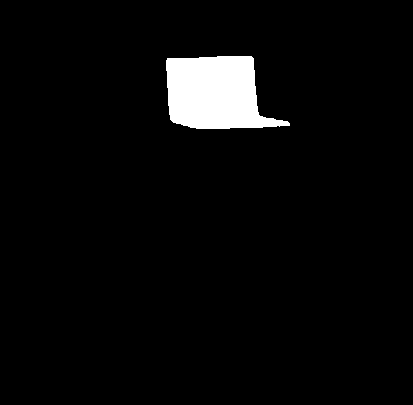
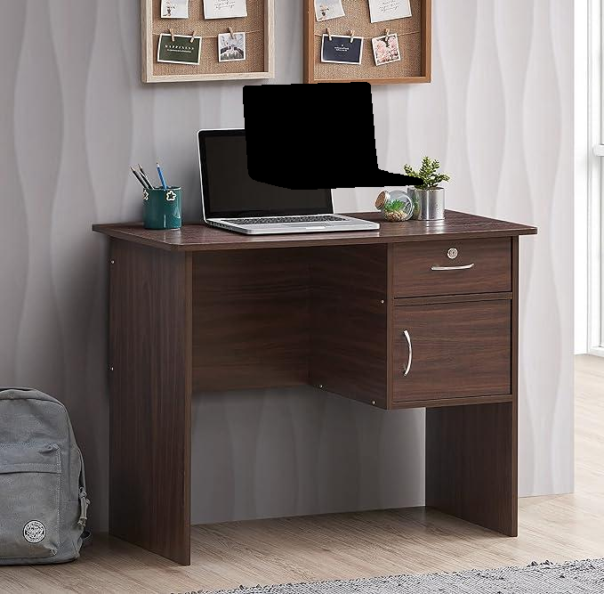

# PixShift


### Prerequisites

- Python 3.11
- WGET
- Cuda

## Installation

Install python packages via commands:
```
pip3 install -r requirements.txt
```
Download pretrained model weights
```
cd PROJECT_ROOT_DIR
bash scripts/download_model.sh
```

 ## Command for TASK 1
```
python run.py --image ./example.jpg --class shelf --output ./generated.png
```

 ## Command for TASK 2
```
python run.py --image ./example.jpg --class shelf --x 80 —-y 0
```


# TASK 1

## Segmentating the Object using text prompt

Using GroundingDino, we are making a Box around the object,which is mentioned in the task, then using Segement-Anything(SAM) we segment the object inside the box. SAM gives us mask image of the object and then we create red mask on the object using mask and original image.

 PROMPT = "BAGPACK"  

 Detect the object based on text prompt using [GroundingDINO](https://github.com/IDEA-Research/GroundingDINO) 
 

 Masking of the object, using [Segment-Anything](https://github.com/facebookresearch/segment-anything)

 


 # Example 1

```
python run.py --image ./examples/bagpack.jpg  --class bagpack --output ./Output/bagpack_mask.png 
```
### ORIGINAL
 

### Mask


 # Example 2

```
python run.py --image ./examples/wall_hanging.jpg  --class wall_haning --output ./Output/Wall_Hanging.png 
```
### ORIGINAL
 

### Mask


 # Example 3

```
python run.py --image ./examples/stool.jpeg  --class stool--output ./Output/stool.png 
```

### ORIGINAL
 

### Mask


# TASK 2
## Change the position of the segmented object using user prompts

Extract the object from image using mask



Shift the object and mask 






Create a Black Hole on the image on the position of the shifted object




Paste the shifted object on the Black hole Image


## Acknowledgments

This project is based on the following repositories:

- [GroundingDINO](https://github.com/IDEA-Research/GroundingDINO)
- [Segment-Anything](https://github.com/facebookresearch/segment-anything)